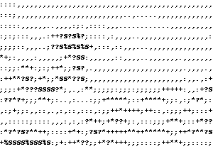
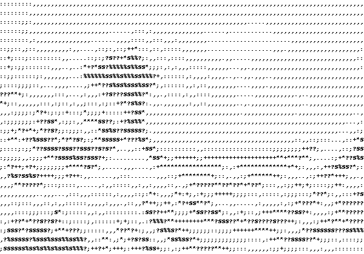
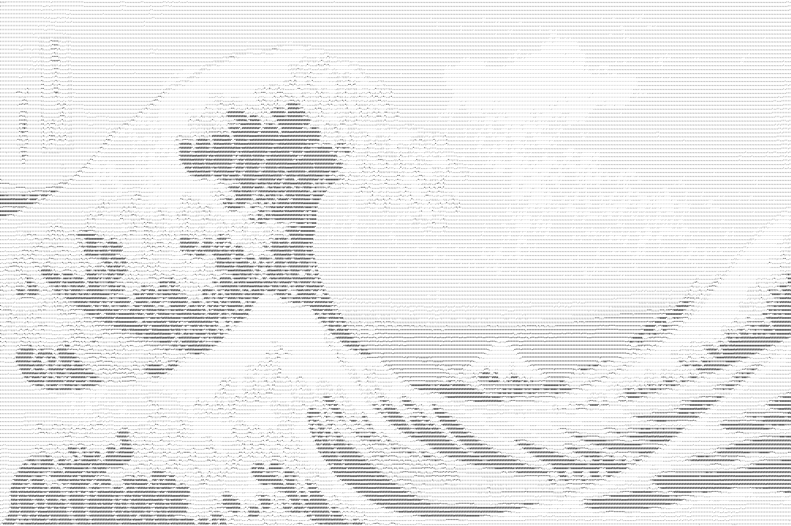

# ASCII-art
In this Python project ASCII art is generated from an input image. This input image is first converted to a grayscale image. 
In the next step every pixel in this grayscale image is mapped to an ASCII character according to the grayscale value of the pixel.
The resulting ASCII characters are then saved in a new image.

## Example

### Input
The input image:  
 

### Output

An output image with 50 x 14 characters used:  
 

An output image with 100 x 28 characters used:  
 

An output image with 500 x 133 characters used:  
 

An output image with 2000 x 510 characters used:  

